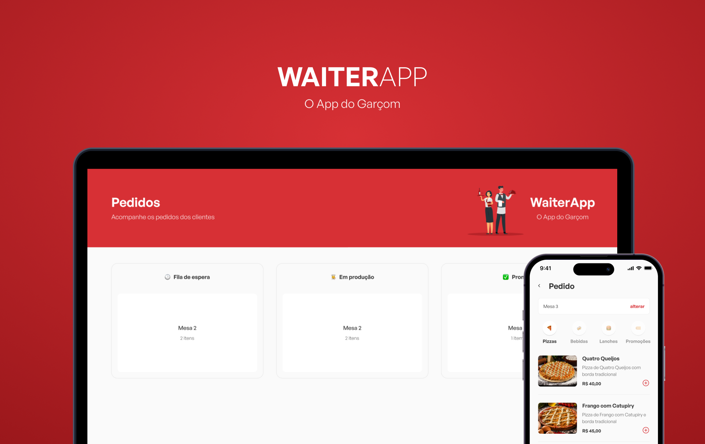

<h1 align="center">
  
</h1>

<h1 align="center">
  
</h1>

# Sobre o projeto

<p>
  Waiter App é uma aplicação para uso interno em lanchonetes, restaurantes, enfim, em qualquer estabelecimento que tenha atendimento em mesas por um garçom. Aqui é a versão web do app, onde lista todos os pedidos e que podem ser cancelados, deletados e ter seu status alterado para acompanhamento em tempo real. Os pedidos são adicionados em tempo real quando o pedido é finalizado pelo app mobile via websocket.
</p>

# Tecnologias

- [ReactJs](https://pt-br.reactjs.org/)
- [Styled-components](https://styled-components.com/)
- [TypeScript](https://www.typescriptlang.org/)
- [React-toastify](https://www.npmjs.com/package/react-toastify)
- [Socket.io](https://socket.io/)
- [Eslint](https://eslint.org/)

## Como baixar o projeto

```bash
# Clonar o repositório
$ git clone https://github.com/wellingtonrodriguesbr/waiter-app-web.git

# Entrar no diretório
$ cd waiter-app-web


# Instalar as dependências
$ npm install

# Rodar o projeto
$ npm run dev
```

<br/>
<hr/>

<p align="center">Desenvolvido por <a href="https://www.linkedin.com/in/wellingtonrodriguesbr/" target="_blank">Wellington Rodrigues</a> ✌🏽</p>
